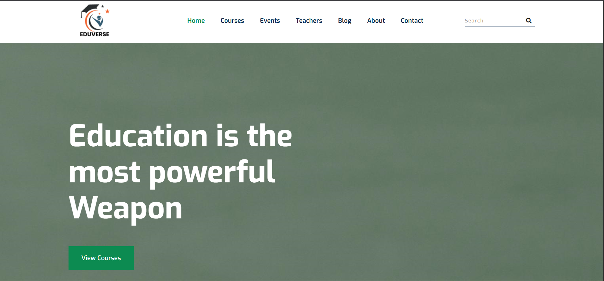
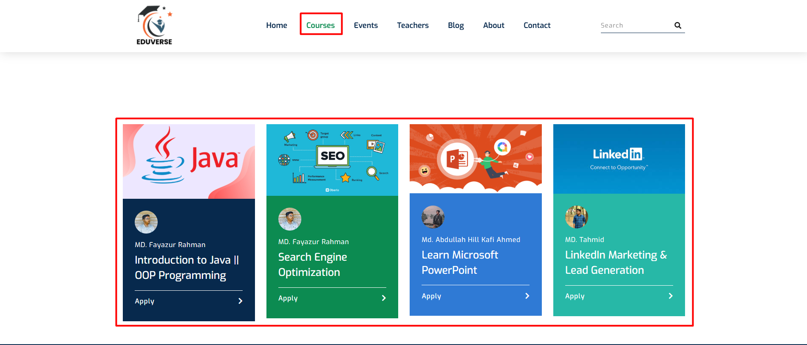
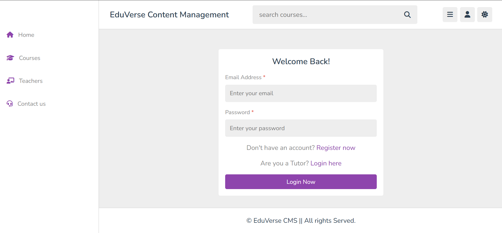
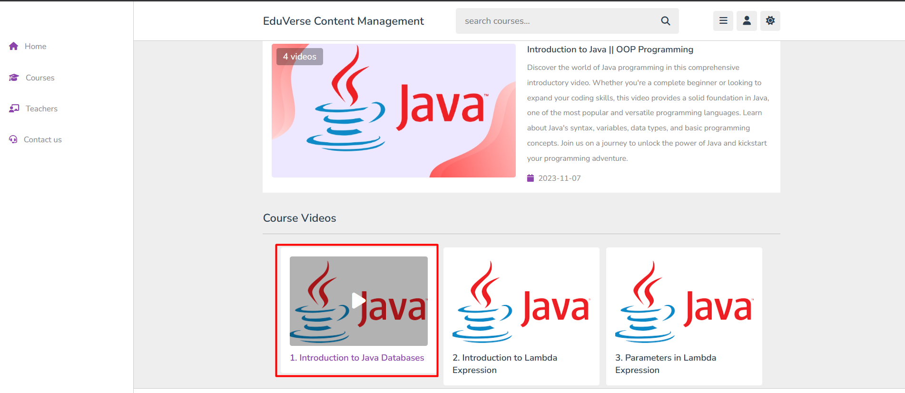

# Eduverse Learning Management System

Eduverse is a comprehensive Learning Management System (LMS) developed using HTML, PHP, and JavaScript. It provides a platform for educators to create and manage courses and for students to enroll and track their progress.

---

## Introduction

Welcome to the Eduverse Learning Management System! This project aims to provide a simple yet effective platform for online learning, connecting educators and students in a virtual environment.

---

## Table of Contents

- [Features](#features)
- [Technologies Used](#technologies-used)
- [Getting Started](#getting-started)
  - [Prerequisites](#prerequisites)
  - [Installation](#installation)
- [Usage](#usage)
- [Screenshots](#screenshots)
- [Contact](#contact)

---

## Features

Here are some of the key features of the Eduverse LMS:

* User authentication (Login/Registration for Students and Educators)
* Course creation and management by Educators
* Student enrollment in courses
* Content delivery, comment, bookmark course


---

## Technologies Used

Eduverse is built using the following technologies:

* **Frontend:**
    * HTML5
    * CSS3 
    * JavaScript
* **Backend:**
    * PHP
* **Database:**
    * MySQL

---

## Getting Started

Follow these steps to set up and run the Eduverse LMS on your local machine.

### Prerequisites

* A web server with PHP support (e.g., Apache, Nginx)
* A database server (e.g., MySQL)
* A web browser

### Installation

1.  Clone the repository:
    ```bash
    git clone https://github.com/fayazur-rahman/eduverse-lms
    ```

2.  Navigate to the project directory:
    ```bash
    cd eduverse-lms
    ```
3.  Set up your web server to point to the project's root directory.

---

## Usage

Explain how to use the LMS. Provide steps for both educators and students.

* **For Educators:**
    * How to register/login.
    * How to create a new course.
    * How to add content to a course.
* **For Students:**
    * How to register/login.
    * How to browse and enroll in courses.
    * How to access course content.
    * Comment and bookmark project

---

## Screenshots

| Eduverse Homepage | Course Lists | CMS Backend | Course Module
|-------------------------------|------------------------------------|------------------------|---------------------------------------|
|  |  |  |  |

> **Figure**: The first image displays the homepage of Eduverse, showcasing available courses in a clean and user-friendly layout. Upon selecting a course, users are redirected to the backend of the Eduverse CMS, where they are required to log in or register. Once authenticated, users gain full access to the course module, including all enrolled courses and related content.

---

## 📧 Contact

For support or collaboration:  
**Email:** fayazur7@gmail.com  
**Developed By:** [MD Fayazur Rahman](https://www.linkedin.com/in/md-fayazur-rahman/)

---
